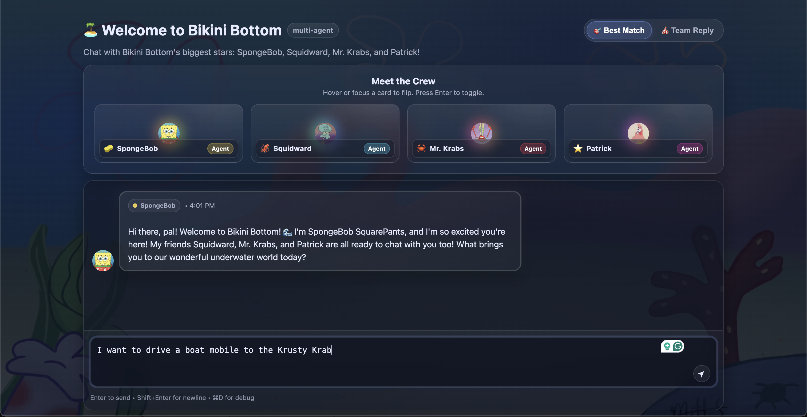

# 🪸 SpongeBob SquareChat

A whimsical multi-agent conversational AI system that brings the beloved characters of Bikini Bottom to life! Chat with SpongeBob, Patrick, Squidward, and Mr. Krabs, each powered by Google's Gemini AI to deliver authentic, character-specific responses.



## 🌊 Live Demo

**[View Live Demo on Vercel →](YOUR_VERCEL_URL_HERE)**

## ✨ Features

- **Multi-Agent System**: Four distinct AI agents, each embodying the personality of a SpongeBob character
  - 🧽 **SpongeBob**: Eternally optimistic, enthusiastic, and sees the bright side of everything
  - ⭐ **Patrick**: Lovably simple, unintentionally wise, and delightfully confused
  - 🦑 **Squidward**: Sophisticated, sarcastic, and perpetually unimpressed
  - 🦀 **Mr. Krabs**: Money-savvy, business-focused, and always thinking about profit

- **Intelligent Orchestration Modes**:
  - 🍔 **Krusty Controller**: Smart routing that selects the most appropriate character based on context
  - 🎪 **Bikini Bottom Chorus**: Harmonizes all four characters into a unified, musical response

- **Beautiful UI**: Immersive Bikini Bottom-themed interface with character avatars and smooth animations

- **Real-time Streaming**: See responses appear character-by-character for a more engaging experience

## 🛠️ Tech Stack

- **Frontend**: SvelteKit 2.5
- **AI**: Google Gemini 2.5 Flash API
- **Deployment**: Vercel
- **Styling**: Modern CSS with custom theming

## 🚀 Getting Started

### Prerequisites

- Node.js 20.x or higher
- npm (comes with Node.js)
- A Google AI Studio API key

### Installation

1. **Clone the repository**
   ```bash
   git clone https://github.com/mohammed-ihtisham/Spongebot-SquareChat
   cd spongebot-squarechat
   ```

2. **Install dependencies**
   ```bash
   npm install
   ```

3. **Set up environment variables**
   
   Create a `.env` file in the root directory:
   ```bash
   cp .env.example .env
   ```
   
   Or create it manually with the following content:
   ```env
   GEMINI_API_KEY=your_api_key_here
   GEMINI_MODEL=gemini-2.5-flash
   ```

4. **Get your Gemini API key**
   - Go to [Google AI Studio](https://aistudio.google.com/)
   - Click "Get API Key"
   - Click "Create API Key"
   - Copy your key and paste it into the `.env` file

5. **Start the development server**
   ```bash
   npm run dev
   ```
   
   Open [http://localhost:5173](http://localhost:5173) in your browser

## 📁 Project Structure

```
spongebot-squarechat/
├── src/
│   ├── lib/
│   │   ├── agents/              # Character AI agents
│   │   │   ├── SpongeBobAgent.js
│   │   │   ├── PatrickAgent.js
│   │   │   ├── SquidwardAgent.js
│   │   │   └── MrKrabsAgent.js
│   │   ├── orchestrators/       # Response coordination systems
│   │   │   ├── BikiniBottomChorus.js
│   │   │   └── KrustyController.js
│   │   ├── components/          # Svelte UI components
│   │   │   ├── AgentAvatar.svelte
│   │   │   └── AgentShowcase.svelte
│   │   └── gemini.js           # Gemini API integration
│   └── routes/
│       ├── +page.svelte        # Main chat interface
│       └── api/chat/
│           └── +server.js      # Backend API endpoint
├── static/                      # Character images and assets
└── README.md
```

## 🎭 How It Works

### Agent System
Each character is implemented as an independent AI agent with:
- **Unique personality prompt**: Defines character traits, speech patterns, and behavior
- **Frame-based responses**: Adapts tone based on conversational context
- **Gemini integration**: Uses Google's latest LLM for natural language generation

### Orchestration
Two orchestration modes handle different conversation scenarios:

1. **Krusty Controller** (Smart Routing):
   - Analyzes user messages for context clues
   - Routes to the most appropriate single character
   - Perfect for targeted, character-specific interactions

2. **Bikini Bottom Chorus** (Ensemble):
   - Gathers responses from all four characters
   - Synthesizes them into a harmonious, unified reply
   - Includes a moral or lesson at the end
   - Great for comprehensive, multi-perspective answers

## 🎨 Features Showcase

- **Character-Specific Responses**: Each agent maintains distinct personality traits
- **Dynamic UI**: Real-time avatar animations and smooth transitions
- **Streaming Responses**: Character-by-character text streaming for engagement
- **Mobile Responsive**: Beautiful experience on all device sizes
- **Error Handling**: Graceful fallbacks with in-character error messages

## 🤝 Contributing

This project was created as part of a multi-agent interaction assignment. Feel free to fork and experiment with your own character agents and orchestration strategies!

## 📝 License

This project is open source and available under the MIT License.

## 🙏 Acknowledgments

- SpongeBob SquarePants © Nickelodeon
- Built with [SvelteKit](https://kit.svelte.dev/)
- Powered by [Google Gemini AI](https://ai.google.dev/)
- Deployed on [Vercel](https://vercel.com)

---

**Note**: This is an educational project demonstrating multi-agent AI systems and is not affiliated with or endorsed by Nickelodeon or Viacom.
